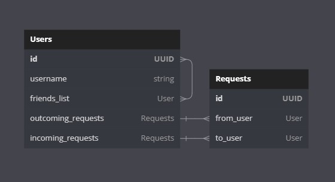

# django_friend_list

## Как запустить

### Через виртуальное окружение python:

- `python -m venv env`

- `cd env`

- `Scripts\activate`

- `git clone https://github.com/Grindmix/django_friend_list.git`

- `cd django_friend_list`

- `python manage.py migrate`

### Запустить тестовый сервер:
- `python manage.py runserver`

### Запустить тесты:
- `python manage.py test`

---
## ER диаграмма



---
## Документация

- browsable api: `host/api/`
- Redoc: `host/redoc/`
- Swagger: `host/swagger/`
- Скачать OpenAPI схему `host/schema/`
---

## Эндпоинты

### CRUD Полльзоветелей
* Создать нового пользователя: `POST /api/register/`
    - Тело запроса:
    ```json
    {
        "username": "string"
    }
    ```
* Список всех пользователей: `GET /api/users/`
* Получить данные пользователя по id: `GET /api/users/{id}`
* Обновить данные пользователя (id  доступно только на чтение) по id: `PUT /api/users/{id}`
    - Тело запроса:
    ```json
    {
        "username": "string"
    }
    ```
* Удалить пользователя по id: `DELETE /api/users/{id}`
* Получить данные пользователя по юзернейму: `GET /api/users/username/{username}`
* Обновить данные пользователя (id  доступно только на чтение) по юзернейму: `PUT /api/users/username/{username}`
    - Тело запроса:
    ```json
    {
        "username": "string"
    }
    ```
* Удалить пользователя по юзернейму: `DELETE /api/users/username/{username}`
* Получить только список друзей пользователя по id: `GET /api/user_friendlist/{id}/`
* Получить статус дружбы: `GET api/user_relationship_status/{id}?user_id=id`

    - Параметр query string user_id это id пользователя с которым нужно проверить статус дружбы и он обязателен.

### CRUD Запросов в друзья
* Получить список всех запросов от всех пользователей: `GET api/list_friend_requests/all/`
* Получить список запросов определенного пользователя: `GET api/list_friend_requests/user/{id}?filter=(incoming_requests, outcoming_requests)`
    - Параметр query string filter позволяет получить только входящие или исходящие запросы, он не обязателен.
* Получить данные запроса по id: `GET /api/request_detail/{id}`
* Обновить запрос по id (id  доступно только на чтение): `PUT /api/request_detail/{id}`
    - Тело запроса:
    ```json
    {
        "from_user": "UUID",
        "to_user": "UUID"
    }
    ```
* Удалить запрос по id: `DELETE /api/request_detail/{id}`

### Добавление в друзья
* Отправить запрос в друзья: `POST /api/send_friend_request/`
    - Если пользователю отправляющему запрос уже прислал запрос адресант, то запрос автоматически примется.
    - Тело запроса:
    ```json
    {
        "from_user": "UUID",
        "to_user": "UUID"
    }
    ```
* Принять/отлонить запрос в друзья по id запроса: `POST /api/accept_or_reject/{id}`
    - Тело запроса:
    ```json
    {
        "actrion": "accept/reject"
    }
    ```

